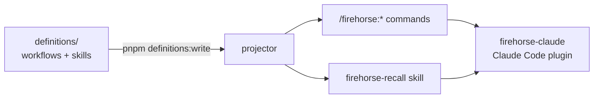
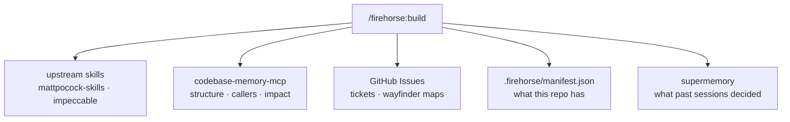

# firehorse

A thin, opinionated layer over the agent skills you already have installed:
eight workflows that hold the shape of a job — plan it, build it, verify it,
ship it — and hand the craft to those skills, adding memory, a codebase map, and
UI critique around them.

## Why it exists

Upstream skills are good at teaching an agent _how_ to do one thing: write the
test first, diagnose a bug, review a diff, chart a map. None of them holds the
parts around that thing:

- **Which seam am I changing, and how do I know?** Firehorse makes the agent
  establish that from the codebase graph, in writing, before it opens a file.
- **Is this evidence or a claim?** Every workflow step ends on a checkable
  condition, and a ticket closes on pasted command output rather than on "done".
- **What does this repo already have?** Setup runs once and records it, so later
  sessions read a manifest instead of re-probing the tree.
- **What happens when an upstream skill moves?** A drift check names which
  workflows a rename broke, and which of their steps no longer hold.

Firehorse owns that spine and vendors nothing. The skills stay upstream, where
their authors maintain them.

## Setup

One command. It adds the upstream marketplaces, installs the plugin and its
dependencies, registers the MCP servers, and brings up the local memory stack.

```sh
curl -fsSL https://raw.githubusercontent.com/cinjoff/firehorse/main/install.sh | bash
```

Restart Claude Code so the plugin, its hooks, and the MCP servers load. Then, in
any repo you want to work in, paste:

```
/firehorse:new-project
```

That sets the repo up once — tracker labels, agent docs, a `DESIGN.md` interview,
the Firehorse manifest — and indexes it. Every later workflow reads what it
recorded.

Everything is idempotent, so re-running repairs rather than duplicates. To see
what is and is not set up without writing anything, ask Claude from any session:

```
/firehorse:firehorse-setup --check
```

From a clone, `./install.sh --check` reports the same thing plus the memory stack.

| Flag              | Effect                                         |
| ----------------- | ---------------------------------------------- |
| `--check`         | Report status. Writes nothing.                 |
| `--yes`           | Accept every prompt. For non-interactive runs. |
| `--skip-memory`   | Leave the self-hosted supermemory stack alone. |
| `--skip-superset` | Leave Superset MCP alone.                      |

<details>
<summary>What the installer does, before you pipe it to bash</summary>

- **Marketplaces** — `pbakaus/impeccable`, `supermemoryai/claude-supermemory`,
  then `cinjoff/firehorse`. The first two come first, because Claude Code cannot
  resolve a dependency from a marketplace it does not know about yet.
- **The plugin** — `firehorse@firehorse`, which pulls `mattpocock-skills`,
  `impeccable`, and `supermemory` with it.
- **MCP servers** — `codebase-memory-mcp` for the structural queries the
  workflows run, and `supermemory-docs` for supermemory's public documentation.
- **Memory** — the self-hosted supermemory server on `localhost:6767`, the
  `gpt-oss:20b` extraction model, the server credentials, a launchd job so it
  survives a reboot, and the `SUPERMEMORY_API_URL` and `SUPERMEMORY_MCP_URL`
  entries Claude Code needs in `~/.claude/settings.json`.
- **Superset MCP** — only when Superset is detected, and always through a
  `headersHelper`, so the API key never lands in a config file.

Everything it writes lives under your home directory: `~/.claude/settings.json`,
`~/.config/firehorse/`, `~/.local/bin/`, `~/.supermemory/`, and one
`~/Library/LaunchAgents/` plist. It touches no repo until you run
`/firehorse:new-project`. From a clone, run `./install.sh` instead of piping.

</details>

Two things the installer cannot do for you. It registers the
`codebase-memory-mcp` server only if you already have the binary — that server
has its own upstream, and it brings the `codebase-memory` skill with it — and it
needs [Ollama](https://ollama.com) running before it can set up memory. It says
so and carries on rather than failing.

## What you get

| Command                      | What it does                                                                             |
| ---------------------------- | ---------------------------------------------------------------------------------------- |
| `/firehorse:new-project`     | Set a repo up once: remote, tracker, labels, manifest, `DESIGN.md`, first index.         |
| `/firehorse:index`           | Make the repo queryable and searchable, and record how fresh that claim is.              |
| `/firehorse:map`             | Chart or work a wayfinder map, carrying this repo's standing preferences into its Notes. |
| `/firehorse:build`           | Take one ticket to a committed, verified change.                                         |
| `/firehorse:fix-bug`         | Go from a bug report to a fix proven to have changed the behaviour.                      |
| `/firehorse:ship`            | Review, PR, merge, changelog, version bump, tags, release, issue closures.               |
| `/firehorse:memory`          | Open the supermemory store as an interactive graph to see what it holds.                 |
| `/firehorse:upstreams-check` | Report upstream skill drift and which workflow steps it breaks.                          |

Plus two skills: `firehorse-recall`, for asking what past sessions decided, and
`firehorse-setup`, for checking this machine's setup.

## How it fits together

You author a workflow once as Markdown with frontmatter. A projector turns it
into the Claude-native files the plugin ships, which are checked in and carry a
SHA-256 of their source.



At runtime a workflow is a conductor. It reaches for the upstream skills that
know the craft, the graph that knows the structure, and the records that know
what happened before.



Each generated workflow carries a table resolving every upstream skill it uses
to its exact `plugin:skill` name and `SKILL.md` path, so no session spends turns
hunting for where a skill lives — and it says which skills an agent can invoke
versus which it has to read and follow, because some upstream skills are
deliberately human-invoked only.

## Contributing

Canonical definitions live in
`packages/firehorse-core/definitions/{workflows,skills}/`. Edit those, never the
generated mirrors under `packages/firehorse-claude/`.

```sh
pnpm install
pnpm definitions:write   # regenerate the checked-in mirrors and manifests
pnpm typecheck
pnpm test
```

Three packages: **`firehorse-core`** holds the definitions, the Firehorse
Definition Format v1 parser, and the projector; **`firehorse-claude`** is the
plugin, discovered through the repo-level `.claude-plugin/marketplace.json`;
**`firehorse-graph`** is the local app `/firehorse:memory` opens. The core
library is not a skill runtime, and nothing here is published to npm — Firehorse
installs through the marketplace.

[`AGENTS.md`](./AGENTS.md) is the contract an agent working on this repo reads
first.

## Further reading

- [Definition format](./docs/FIREHORSE-DEFINITION-FORMAT.md) — the v1 contract
- [Architecture](./docs/ARCHITECTURE.md) — why the pieces are split this way
- [Memory runbook](./docs/MEMORY.md) — what the memory half does, and how it
  fails quietly
- [Decisions](./docs/DECISIONS.md) — binding, append-only
- [Project vision and scope](./docs/PROJECT.md)
- [Migration plan](./docs/MIGRATION-PLAN.md) — the settled Claude-only
  migration; the Pi distribution and vendored mirrors are recoverable from the
  `pi-v0.3.0` tag
- [Claude plugin README](./packages/firehorse-claude/README.md)
- [Changelog](./CHANGELOG.md)

## License

MIT.
