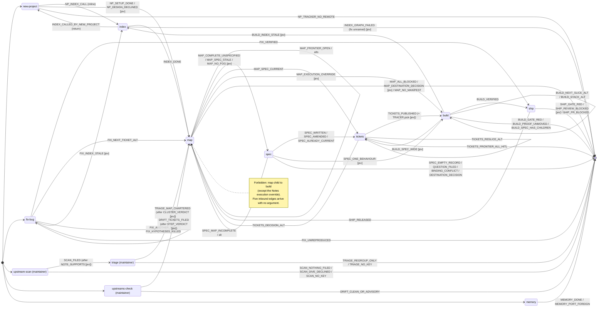

# Workflow transitions: the handoff table as a state machine

This note parses every `## Handoff` section in
`packages/firehorse-core/definitions/workflows/*.md`, shipped and maintainer, into one
transition table. It also takes in the `## Procedure` and `## Safety Gates` routing that decides
whether a handoff renders and what it offers. It is the input to candidate move 1 in
[`README.md`](./README.md): parse the transition table and lint reachability.

**Window:** read 2026-09-27, against the working tree at that date. Line numbers are
`file:line` in `packages/firehorse-core/definitions/workflows/`.

## Conventions

- **from-state** is the workflow whose run just ended. **target** is the command the block
  offers. `none` means the run ends at its report with no block. `STOP` means the run halts
  before its report step.
- **event** is a coined outcome name. Several rows are *parameter picks*, marked `→ param`:
  the route is fixed, but which ticket it names still has to be chosen.
- **evidence**:
  - `git`: the working tree or history, including `.firehorse/manifest.json` and committed docs.
  - `tracker`: GitHub issues, labels, sub-issues, PRs and releases, read through `gh`.
  - `gate cmd`: the exit status or output of a command the workflow runs.
  - `conversation-only`: nothing outside this session records the fact.
- **kind**:
  - `code`: a deterministic predicate over the evidence.
  - `jev`: a bounded pick among concrete actions that needs judgement. Each `jev` row has its
    option list in [Jev option sets](#jev-option-sets).
  - An "Also available" line is shown whenever its block renders, so it is classed `code` with
    evidence `none`. Its prose is a hint to the user, not a guard.
- A `code` row whose only evidence is `conversation-only` (R6, R45, R59) is deterministic, but
  a hook cannot check it until the session writes the fact somewhere it can read.

## Transition table

| # | from-state | event | target command | guard as written | evidence | kind | cite |
|---|---|---|---|---|---|---|---|
| R1 | new-project | `NP_SETUP_DONE` | `/firehorse:map` (after `/clear`) | "Close the run with this block, after the step-8 report" | none (unconditional after step 8) | code | new-project.md:138-148 |
| R2 | new-project | `NP_INDEX_CALL` | `/firehorse:index` (inline call, not a handoff) | "**Call `/firehorse:index`.**" | none | code | new-project.md:126-127, 70 |
| R3 | new-project | `NP_DESIGN_DECLINED` | `/firehorse:map` with an in-block note | "`DESIGN.md` absent because the user declined the interview → say so inside the block" | git (`anchors.design: false`) + conversation-only (the reason) | jev | new-project.md:154, 124-125 |
| R4 | new-project | `NP_TRACKER_NO_REMOTE` | STOP (ask) | "A hosted tracker with no remote is the stop-and-ask step 1 deferred." | git (`git remote -v`, `docs/agents/issue-tracker.md`) | code | new-project.md:118, 106 |
| R5 | index | `INDEX_DONE` | `/firehorse:map` (after `/clear`) | "Close the run with this block, after the step-8 report" | git (manifest `index.graph: true`) | code | index.md:132-142 |
| R6 | index | `INDEX_CALLED_BY_NEW_PROJECT` | none (returns to new-project step 7) | "Skip the block entirely when `/firehorse:new-project` called this run at its step 6." | conversation-only | code | index.md:146 |
| R7 | index | `INDEX_GRAPH_FAILED` | "the fix" (not named) | "Where the graph pass failed, offer the fix rather than the map" | git (manifest `index.graph: false`, step-2 failure text) | jev | index.md:148, 104 |
| R8 | map | `MAP_NO_MANIFEST` | STOP | "No manifest → the repo has not run `/firehorse:new-project`; say so and stop." | git (`.firehorse/manifest.json` exists) | code | map.md:125 |
| R9 | map | `MAP_NO_FOG` | offer `/firehorse:spec`, create no map | "No fog means no map. … Do not create the map: say so, and offer `/firehorse:spec`." | conversation-only | jev | map.md:81 |
| R10 | map | `MAP_FRONTIER_OPEN` | `/firehorse:map <map> <ticket>` | "Route on what the map holds now, not on what this session did." | tracker (open children, blockers, claims) | code | map.md:145-155 |
| R11 | map | `MAP_PICK_TICKET` → param | `<ticket>` in R10 | "**Name the ticket the map leaves open,** not the one step 5 resolved." | tracker | jev | map.md:194 |
| R12 | map | `MAP_FRONTIER_ALT` | `/firehorse:map <map>` | "let the next session pick from the frontier" | none | code | map.md:158 |
| R13 | map | `MAP_COMPLETE_UNSPECIFIED` | `/firehorse:spec <map>` | "The map with no open children and nothing under `## Not yet specified` is complete" | tracker (child states, map body, spec link in body) | code | map.md:162-172 |
| R14 | map | `MAP_COMPLETE_REOPEN_ALT` | `/firehorse:map <map>` | "one more decision surfaced; reopen the map for it" | none | code | map.md:175 |
| R15 | map | `MAP_SPEC_STALE` | `/firehorse:spec <map>` (amend) | "Where tickets have closed since that spec was written, the block offers `/firehorse:spec <map>` to amend it" | tracker (child `closedAt` vs spec date or last amendment) | code | map.md:179 |
| R16 | map | `MAP_SPEC_CURRENT` | `/firehorse:tickets <spec>` | "where nothing has closed since, the work is already specified" | tracker | code | map.md:179-190 |
| R17 | map | `MAP_EXECUTION_OVERRIDE` | `/firehorse:build <child>` plus the authorising Notes line | "The one exception is an effort whose `## Notes` carries execution into the map … a child may be buildable" | tracker (map `## Notes` prose) | jev | map.md:196 |
| R18 | map | `MAP_ALL_BLOCKED` | none; name what unblocks | "**Every child blocked and none takeable** → say so, name what unblocks the frontier, and offer nothing else." | tracker (blocked-by edges, assignees) | code | map.md:197 |
| R19 | map | `MAP_DESTINATION_DECISION` | none (terminal) | "**The destination was a decision rather than a change** → the map ends at step 6. Say so and offer nothing" | tracker (map `## Destination` prose) | jev | map.md:198 |
| R20 | spec | `SPEC_MAP_INCOMPLETE` | `/firehorse:map <map>` (only offer) | "Any open child, or any content under `## Not yet specified` … stop and offer `/firehorse:map`." | tracker | code | spec.md:106, 88, 153 |
| R21 | spec | `SPEC_WRITTEN` | `/firehorse:tickets <spec>` | "no spec, closed children \| writes the spec" | tracker | code | spec.md:110, 136-144 |
| R22 | spec | `SPEC_AMENDED` | `/firehorse:tickets <spec>` | "a spec, tickets closed since \| amends that spec, dated" | tracker | code | spec.md:111, 136-144 |
| R23 | spec | `SPEC_ALREADY_CURRENT` | `/firehorse:tickets <spec>` | "a spec, nothing closed since \| stops, and routes to `/firehorse:tickets`" | tracker | code | spec.md:112 |
| R24 | spec | `SPEC_EMPTY_RECORD` | STOP | "no closed children at all \| stops: a complete map with an empty record has nothing to write a spec from" | tracker | code | spec.md:113 |
| R25 | spec | `SPEC_QUESTION_FILED` | STOP (implicitly `/firehorse:map`) | "File it as a child of the map, say so, and stop." | conversation-only | jev | spec.md:87 |
| R26 | spec | `SPEC_BINDING_CONFLICT` | STOP | "the decision wins and the contradiction is the finding: name the decision, and stop" | git (`docs/DECISIONS.md`) + tracker | jev | spec.md:90, 118 |
| R27 | spec | `SPEC_DESTINATION_DECISION` | STOP | "A map whose destination was a decision rather than a change needs no spec at all. Say so and stop" | tracker | jev | spec.md:98 |
| R28 | spec | `SPEC_DECISION_SURFACED_ALT` | `/firehorse:map <map>` | "a decision surfaced while writing; resolve it first" | none | code | spec.md:147 |
| R29 | spec | `SPEC_ONE_BEHAVIOUR` | `/firehorse:build <spec>` | "Offer `/firehorse:build <spec>` only where the spec names one behaviour at one confirmed seam." | tracker (spec body, seam list) | jev | spec.md:148, 154 |
| R30 | tickets | `TICKETS_PUBLISHED` | `/firehorse:build <ticket>` | "Close the run with this block, after the step-7 report" | tracker (frontier, labels) | code | tickets.md:138-148 |
| R31 | tickets | `TICKETS_PICK_TRACER` → param | `<ticket>` in R30 | "**Name the tracer bullet,** not the slice that happens to be first in the list." | tracker | jev | tickets.md:157 |
| R32 | tickets | `TICKETS_RESLICE_ALT` | `/firehorse:tickets <spec>` | "re-slice; it reads the published slices first and asks before changing any" | none | code | tickets.md:151 |
| R33 | tickets | `TICKETS_DECISION_ALT` | `/firehorse:map <map>` | "a slice exposed a decision nobody made" | none | code | tickets.md:152 |
| R34 | tickets | `TICKETS_FRONTIER_ALL_HITL` | none; name the human decisions | "**Every frontier slice is HITL** → say so and name the human decision each one waits on" | tracker (triage labels on frontier) | code | tickets.md:158 |
| R35 | spec, tickets, build, fix-bug | `NO_TRACKER_DOC` | STOP (ask) | "Absent → say so and ask, rather than assuming GitHub." | git (`docs/agents/issue-tracker.md` exists) | code | spec.md:60; tickets.md:58; build.md:65; fix-bug.md:56 |
| R36 | build | `BUILD_SPEC_HAS_CHILDREN` | report the frontier and name a slice (block unstated) | "children already published means this run builds nothing, and instead reports the frontier and names the slice to start with" | tracker | code | build.md:108, 59, 92 |
| R37 | build | `BUILD_SPEC_WIDE` | `/firehorse:tickets` | "No children and anything wider means route to `/firehorse:tickets` and stop." | tracker (spec body) | jev | build.md:108 |
| R38 | build | `BUILD_INDEX_STALE` | `/firehorse:index`, or state the gap | "`index_status` behind HEAD … run `/firehorse:index`, or state the gap in the report." | git (HEAD) + gate cmd (`index_status`) | jev | build.md:100 |
| R39 | build | `BUILD_GATE_RED` | none | "**A red gate ends the run at step 7,** and the block goes with it." | gate cmd | code | build.md:156, 129 |
| R40 | build | `BUILD_PROOF_UNMOVED` | STOP (block unstated) | "or a red gate or a proof that did not move is recorded and the run stops here" | gate cmd (proof output vs `After`) | code | build.md:129 |
| R41 | build | `BUILD_VERIFIED` | `/firehorse:ship` (no `/clear`) | "every gate is green and the proof command prints the `After` the ticket named" | gate cmd + tracker (step-9 comment, issue still open) | code | build.md:129, 135, 141-147 |
| R42 | build | `BUILD_NEXT_SLICE_ALT` | `/clear` then `/firehorse:build <n>` | "the next unblocked slice, read from the spec's children" | tracker | code | build.md:150 |
| R43 | build | `BUILD_STACK_ALT` | `/firehorse:build <n>` (no `/clear`) | "another slice onto this branch first, no clear" | none | code | build.md:151 |
| R44 | fix-bug | `FIX_UNREPRODUCED` | none | "Where the step-2 loop never went red, the run stops there and the block does not render" | gate cmd (loop output) | code | fix-bug.md:141, 79 |
| R45 | fix-bug | `FIX_HYPOTHESES_KILLED` | loop back to step 4 | "All killed, return to step 4." | conversation-only | code | fix-bug.md:108 |
| R46 | fix-bug | `FIX_INDEX_STALE` | `/firehorse:index`, or state the gap | "`index_status` behind HEAD … run `/firehorse:index`, or state the gap." | git + gate cmd (`index_status`) | jev | fix-bug.md:91 |
| R47 | fix-bug | `FIX_VERIFIED` | `/firehorse:ship` (no `/clear`) | "all three outputs are captured and the gate is green" | gate cmd + tracker (step-9 comment) | code | fix-bug.md:114, 126-132 |
| R48 | fix-bug | `FIX_NEXT_TICKET_ALT` | `/clear` then `/firehorse:map <map>` | "pick the next ticket from the frontier" | none | code | fix-bug.md:135 |
| R49 | fix-bug | `FIX_ANOTHER_ALT` | `/firehorse:fix-bug <n>` | "another bug onto this branch first" | none | code | fix-bug.md:136 |
| R50 | ship | `SHIP_GATE_RED` | none | "A red check ends the run." / "a red gate at step 1" | gate cmd (the seven gate checks) | code | ship.md:136, 185 |
| R51 | ship | `SHIP_REVIEW_BLOCKED` | none | "a review that found something … all end the run in place" | conversation-only (code-review report) | jev | ship.md:185, 139 |
| R52 | ship | `SHIP_PR_BLOCKED` | none | "**No block where the merge did not happen.** A blocked PR" | tracker (`gh pr view` state and checks) | code | ship.md:185, 147 |
| R53 | ship | `SHIP_RELEASED` | `/firehorse:map` (after `/clear`) | "Close the run with this block, after the step-12 report" | git (both tags) + tracker (release, closed issues) | code | ship.md:170-180 |
| R54 | triage | `TRIAGE_NO_KEY` | STOP | "Without it the script exits and nothing else in this workflow runs." | gate cmd (`pnpm triage` exit) | code | triage.md:43 |
| R55 | triage | `TRIAGE_CLUSTER_VERDICT` | charter a map (step 3), or rule leftovers | "say whether it is a missing map or a set of genuinely unrelated leftovers" | tracker + report JSON | jev | triage.md:86 |
| R56 | triage | `TRIAGE_MAP_CHARTERED` | `/firehorse:map` (after `/clear`) | "Render this block only when step 3 chartered a map." | tracker (a `wayfinder:map` created during the run) | code | triage.md:109-119 |
| R57 | triage | `TRIAGE_REGROUP_ONLY` | none | "**No new map, no handoff.**" | tracker | code | triage.md:109, 123 |
| R58 | upstream-scan | `SCAN_NO_KEY` | STOP | "Without it the script exits and nothing else in this workflow runs." | gate cmd (`pnpm upstream-scan` exit) | code | upstream-scan.md:54 |
| R59 | upstream-scan | `SCAN_DIVE_DECLINED` | none | "or that ended at the step-7 decline, ends at the step-11 report" | conversation-only (user's answer) | code | upstream-scan.md:157, 141 |
| R60 | upstream-scan | `SCAN_NOTE_SUPPORTS` | file an issue, or add a no-issue line to the note | "File an `Evaluation candidate` issue per candidate the note still supports" | git (research note) | jev | upstream-scan.md:146-147 |
| R61 | upstream-scan | `SCAN_FILED` | `/triage` (after `/clear`) | "Render this block only when step 9 filed at least one issue." | tracker | code | upstream-scan.md:157-167 |
| R62 | upstream-scan | `SCAN_NOTHING_FILED` | none | "**No issues filed, no handoff.**" | tracker | code | upstream-scan.md:157, 171 |
| R63 | upstreams-check | `DRIFT_STEP_VERDICT` | step holds (advisory), or fails (ticket) | "Per step: whether it still holds" | git (new `SKILL.md` on disk + definition body) | jev | upstreams-check.md:104, 74 |
| R64 | upstreams-check | `DRIFT_TICKETS_FILED` | `/firehorse:map` (after `/clear`) | "Render this block only when step 6 filed tickets" | tracker | code | upstreams-check.md:121-131 |
| R65 | upstreams-check | `DRIFT_CLEAN_OR_ADVISORY` | none | "A clean comparison, or one whose findings were all advisory, ends at the step-8 report." | gate cmd (`pnpm upstreams:check`) + tracker | code | upstreams-check.md:121, 135-136 |
| R66 | memory | `MEMORY_DONE` | none (terminal) | "This workflow renders no handoff block, and that is deliberate." | none | code | memory.md:90-94 |
| R67 | memory | `MEMORY_PORT_FOREIGN` | STOP | "`Port … is taken by something that is not firehorse-graph` means stop and tell the user." | gate cmd (first line of `serve`) | code | memory.md:73, 57 |

**Counts:** 67 rows, 49 `code` and 18 `jev`.

## Jev option sets

Each set ends with "None of these." A "None of these." pick falls back to the workflow's
report with no block.

| row | options |
|---|---|
| R3 | Render the map block with "DESIGN.md absent: user declined the interview" · Render the map block with no DESIGN note (no UI surface) · None of these. |
| R7 | Offer `/firehorse:index --graph-only` after configuring `codebase-memory-mcp` · Offer `/firehorse:map` anyway, and name the failed pass · None of these. |
| R9 | Create the map and continue charting · Create no map, and offer `/firehorse:spec` · None of these. |
| R11 | Name frontier ticket #a · Name frontier ticket #b · … (one per open child with no open blocker) · None of these. |
| R17 | Offer `/firehorse:build <child>` and quote Notes line L · Offer `/firehorse:map <map> <child>` (Notes does not authorise execution) · None of these. |
| R19 | End the map and offer nothing (the destination was a decision) · Route on completeness (R13/R15/R16) · None of these. |
| R25 | File question Q as a child of the map and stop · Record Q as answered by closed ticket #n and continue · None of these. |
| R26 | Stop and name decision D-n as contradicting ticket #m · Continue: no binding decision is contradicted · None of these. |
| R27 | Stop: no spec (the destination was a decision) · Continue to write the spec · None of these. |
| R29 | Offer `/firehorse:build <spec>` as an alternative · Offer `/firehorse:tickets <spec>` only · None of these. |
| R31 | Name slice #a as the tracer bullet · Name slice #b · … (one per frontier slice) · None of these. |
| R37 | Build it here (one behaviour, one confirmed seam) · Route to `/firehorse:tickets` and stop · None of these. |
| R38, R46 | Stop and offer `/firehorse:index` before continuing · Continue, and state the index gap in the report · None of these. |
| R51 | Fix the blocker as a commit and continue · State the blocker on the PR with a reason and continue · End the run in place with no block · None of these. |
| R55 | Charter map M for cluster C · Rule cluster C as unrelated leftovers · None of these. |
| R60 | File an `Evaluation candidate` issue scoped to part P · Write a no-issue line in the note · None of these. |
| R63 | Step S holds against the new `SKILL.md` · Step S fails: file a ticket naming what moved · None of these. |

## Ambiguous routes

In each case below, two variants apply at once, or none does.

1. **`/firehorse:map` with no argument has no defined behaviour.** Five blocks offer it bare:
   new-project.md:147, index.md:142, ship.md:180, triage.md:119 and upstreams-check.md:131.
   Map's Usage and Inputs define only "a loose idea" or "a map issue reference"
   (map.md:49, 53). Spec defines a no-argument path (spec.md:53); map does not.
2. **A map with no open children but fog left under `## Not yet specified` matches no block.**
   It is not complete (map.md:162). It has no frontier ticket to name (map.md:151, 194). It is
   not "every child blocked" either, because there are no children (map.md:197).
3. **The execution override and the default frontier block both apply.** When the override
   holds (map.md:196), nothing says whether the build line replaces the
   `/firehorse:map <map> <ticket>` line (map.md:155) or sits beside it.
4. **Map → spec is a dead route when the record is empty.** A complete map with zero closed
   children gets `/firehorse:spec` (map.md:162-172), and spec then stops on row 4 of its routing
   table (spec.md:113). Separately, a complete map whose destination was a decision matches
   both R13 and R19, and no precedence is stated.
5. **A research ticket on the frontier.** "One ticket per session, research tickets excepted"
   (map.md:80). The block names one `<ticket>`, and nothing says whether a research ticket
   counts or whether several may be named.
6. **Index's "offer the fix" names no command** (index.md:148). With `--memory-only` or
   `--anchors-only` (index.md:46), the graph pass did not run at all. Nothing says whether a
   graph pass that did not run counts as failed.
7. **Index inside new-project swallows the failed-graph route.** Index suppresses its block when
   called from new-project (index.md:146). New-project then offers `/firehorse:map`
   unconditionally (new-project.md:140-148), which is exactly what index.md:148 forbids after a
   failed graph pass.
8. **New-project's stop-and-ask** (new-project.md:118) does not say whether its block renders.
9. **Four of spec's stops do not say what the block offers:** the empty record (spec.md:113),
   a question filed (87), a binding conflict (90) and a destination that was a decision (98).
   Only the completeness-gate stop is specified (spec.md:153).
10. **A spec run from the conversation has no map.** Spec can run from the conversation alone
    (spec.md:53), but its block still offers `/firehorse:map <map>` (spec.md:147) and links the
    spec from a map (spec.md:126).
11. **The tracer bullet may not be on the frontier.** Tickets requires naming the tracer bullet
    from the frontier (tickets.md:157), but "prefactor before the work it eases"
    (tickets.md:109) can leave the tracer bullet blocked.
12. **Tickets step 4 has no exit.** "Iterate until approved" (tickets.md:124) gives no route for
    a breakdown the user never approves.
13. **Build given a sliced spec.** It "reports the frontier and names the slice" (build.md:108),
    but the handoff does not say whether the block renders or which command it offers. Step 9
    never runs, so the "Ship" block's premise is false.
14. **Build's stop on an unmoved proof** (build.md:129) is not covered by the handoff, which
    drops the block only for a red gate (build.md:156). A ticket with no Proof block
    (build.md:128) reaches ship on the gate alone.
15. **The stale-index "or" routes to index with no return edge.** Build and fix-bug offer to
    run `/firehorse:index` or state the gap (build.md:100, fix-bug.md:91), but index's own
    handoff goes to map, not back to the interrupted build.
16. **Fix-bug with a red gate at step 7** (fix-bug.md:114) is not covered by the handoff, which
    covers only the unreproduced loop (fix-bug.md:141). The step-5 → step-4 loop
    (fix-bug.md:108) has no bound.
17. **Fix-bug's `/firehorse:map <map>` alternative** (fix-bug.md:135) assumes a map. Bugs
    reported from a description, a log or a failing test (fix-bug.md:49) have none.
18. **Ship's no-block rule contradicts its procedure in two places.** It says "a red gate at step
    1" (ship.md:185), but the gate is step 2 (ship.md:135). It says "a review that found
    something" ends the run (ship.md:185), while step 3 lets explained blockers continue
    (ship.md:139).
19. **Ship after the merge.** The rule keys only on the merge (ship.md:185). If a tag, the
    release or an issue closure fails after the merge (steps 9-11), the block still renders,
    and its "v<version> closed <n> issues" line becomes false. An empty diff at step 1
    (ship.md:132) has no route.
20. **Triage's Usage and Procedure disagree about writes.** With no arguments, Usage says the
    run changes nothing (triage.md:36). The procedure charters maps at step 3 and runs
    `--apply` at step 6 regardless (triage.md:89, 98). R56's guard depends on which reading
    holds. The block also offers bare `/firehorse:map` for a map that is already chartered
    (triage.md:119).
21. **Upstreams-check with an advisory finding whose step-4 verdict failed.** Step 6 files
    tickets only for "breaking findings" (upstreams-check.md:110-111). Lines 74, 111 and 136
    treat a failed verdict as making the finding breaking. Whether a ticket is filed, and so
    whether the block renders, is unsettled.

## States no route reaches

These are counted over handoff blocks and procedure calls.

- **new-project:** no inbound edge. It is the entry point. `hooks/check-setup.mjs` may suggest
  it, but that is outside the definitions.
- **upstream-scan, upstreams-check and memory:** no inbound edge. Each is entered only by hand.
- **fix-bug:** reached only by its own alternative (fix-bug.md:136). No workflow routes a
  found bug to it.
- **index:** reached only as new-project's inline step-6 call and through the stale-index
  detours in build and fix-bug (build.md:100, fix-bug.md:91). No handoff block offers it, and
  new-project.md:153 forbids offering it.
- **triage:** reached only from upstream-scan's `/triage` (upstream-scan.md:167), under the
  maintainer namespace rather than `/firehorse:`.

## Terminal states

- **memory:** always terminal. It renders no block by design (memory.md:90).
- **No block, run ends at its report:**
  - map: R18 (all blocked), R19 (destination was a decision)
  - tickets: R34 (frontier all HITL)
  - build: R39 (gate red)
  - fix-bug: R44 (unreproduced)
  - ship: R50 (gate red), R51 (review blocked), R52 (PR blocked)
  - triage: R57 (regroup only)
  - upstream-scan: R59 (dive declined), R62 (nothing filed)
  - upstreams-check: R65 (clean or advisory)
  - index: R6 (called by new-project; returns to its caller)
- **STOP before the report:**
  - new-project: R4 (tracker with no remote)
  - map: R8 (no manifest)
  - spec: R24 (empty record), R25 (question filed), R26 (binding conflict), R27 (destination
    was a decision)
  - spec, tickets, build and fix-bug: R35 (no tracker doc)
  - build: R40 (proof did not move)
  - triage: R54 (no API key)
  - upstream-scan: R58 (no API key)
  - memory: R67 (port taken)
- **The cycle has no end state.** The happy path runs map → spec → tickets → build → ship →
  map, and every non-memory route ends in a stop or returns to map.

## Forbidden edges stated explicitly

| forbidden | cite |
|---|---|
| map (child ticket) → `/firehorse:build`, unless the Notes execution override applies | map.md:82, 195-196 |
| map → create a map when charting surfaced no fog (offer spec instead) | map.md:81 |
| spec with an incomplete map → spec; the only offer is `/firehorse:map` | spec.md:88, 153 |
| spec → `/firehorse:build <spec>` unless the spec is one behaviour at one confirmed seam | spec.md:154 |
| spec wired as a sub-issue or dependency of the map | spec.md:126 |
| build ← a sliced spec (it reads the frontier and hands back), or ← a wide spec (it routes to tickets) | build.md:59, 92, 108 |
| tickets → `/firehorse:build` when every frontier slice is HITL | tickets.md:158 |
| tickets → a tracker-wide re-triage from inside the run | tickets.md:99 |
| index → `/firehorse:map` when the graph pass failed | index.md:148 |
| index → a block of its own when new-project called it (no two blocks in a row) | index.md:146 |
| new-project → `/firehorse:index` in the block | new-project.md:153 |
| build or fix-bug → `/clear` before `/firehorse:ship` | build.md:155; fix-bug.md:140 |
| build → any block after a red gate; fix-bug → any block after an unreproduced loop | build.md:156; fix-bug.md:141 |
| ship → `/firehorse:map` when the merge did not happen | ship.md:185 |
| triage → `pnpm triage --apply` in the block | triage.md:124 |
| upstream-scan → the deep dive in the block | upstream-scan.md:172 |
| upstreams-check → `pnpm upstreams:check --write` in the block | upstreams-check.md:137 |
| any workflow → running the next command itself (advisory voice) | index.md:149; map.md:199; tickets.md:159; build.md:157; fix-bug.md:142; ship.md:186; spec.md:155; new-project.md:155; triage.md:125; upstream-scan.md:173; upstreams-check.md:138 |

## Route diagram

